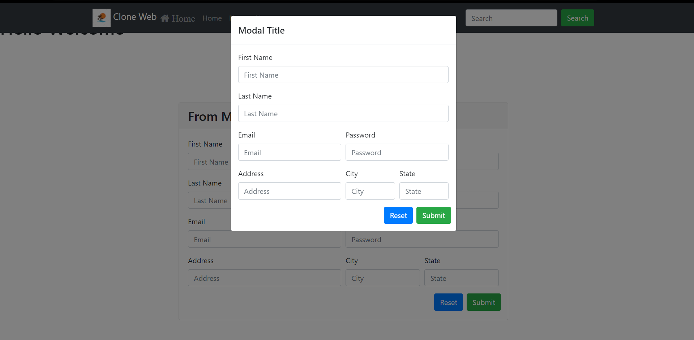
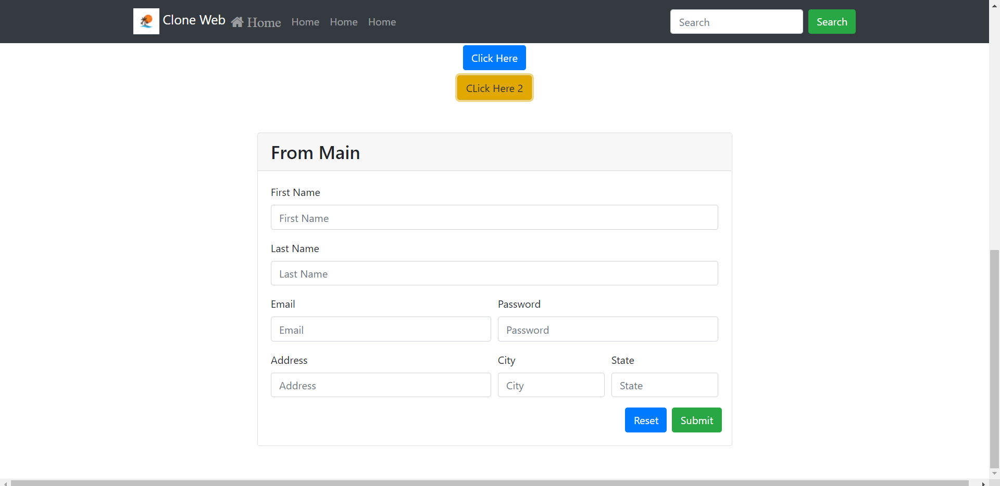

# Clone Web Trial

http://127.0.0.1:8000
## Screenshots

## Getting Started
To get the Node Server running locally:
- Clone this repo
- `npm install` to install all required dependencies.
- `npm start` to run server.

For Front-End - Using Bootstrap:
- `npm install bootstrap` to install bootstrap into your Project.

## Description
It's a normal trial application to demonstrate Bootstrap components.

## Application Structure
 - `package.json` - JSON file that exists at the root of a Javascript project.